# Modular Electronic Warfare (EW) Radar/Emitter Simulation Architecture & Data-Flow Reference

> **Document Version**: 1.0.0  
> **Status**: Approved Phase 1 Foundation & Communication Architecture  
> **Target File**: `docs/CODEBASE_ARCHITECTURE.md`  
> **Purpose**: Complete, authoritative, end-to-end architectural mapping and variable data-lineage reference for the EW Radar/Emitter Simulation codebase.

---

## Table of Contents

1. [Repository Map](#1-repository-map)
2. [File-by-File Responsibility Map](#2-file-by-file-responsibility-map)
3. [Import & Dependency Graph](#3-import--dependency-graph)
4. [Runtime Architecture](#4-runtime-architecture)
5. [Frontend Architecture](#5-frontend-architecture)
6. [Backend Service Architecture](#6-backend-service-architecture)
7. [Data Model Map](#7-data-model-map)
8. [Variable Data-Lineage Analysis](#8-variable-data-lineage-analysis)
9. [API Flow & Endpoints](#9-api-flow--endpoints)
10. [WebSocket Flow & Streaming Protocol](#10-websocket-flow--streaming-protocol)
11. [Simulation-Time Flow & Clock Engine](#11-simulation-time-flow--clock-engine)
12. [Emitter ↔ Receiver Decoupled Flow](#12-emitter--receiver-decoupled-flow)
13. [Receiver Scan Lifecycle](#13-receiver-scan-lifecycle)
14. [Observation Lifecycle](#14-observation-lifecycle)
15. [Frontend Update & Rendering Lifecycle](#15-frontend-update--rendering-lifecycle)
16. [Complete End-to-End Execution Trace](#16-complete-end-to-end-execution-trace)
17. [Deployment & Runtime Topology](#17-deployment--runtime-topology)
18. [Future Extension Points & Boundaries](#18-future-extension-points--boundaries)

---

## 1. Repository Map

```text
Prototype_v1.0.0/
├── .env                              # Active environment configuration for local run
├── .env.example                      # Template environment variables for developers
├── .gitignore                        # Git exclusion rules (venv, node_modules, cache)
├── docker-compose.yml                # Multi-container orchestration (backend:8000, frontend:3000)
├── README.md                         # Project overview, beginner setup guide, API docs
│
├── backend/                          # Python 3.10+ FastAPI backend service
│   ├── Dockerfile                    # Container definition for backend service
│   ├── requirements.txt              # Pinned Python package dependencies
│   ├── __init__.py                   # Top-level backend package marker
│   │
│   ├── shared/                       # Cross-cutting foundational abstractions
│   │   ├── __init__.py               # Shared package marker
│   │   ├── clock.py                  # SimulationClock (thread-safe, discrete timekeeper)
│   │   ├── config.py                 # Settings (BaseSettings with env file support)
│   │   ├── events.py                 # Async in-memory EventBus (publish/subscribe)
│   │   └── models.py                 # Shared Pydantic schemas (events, scans, observations)
│   │
│   ├── emitter/                      # Emitter simulation service
│   │   ├── __init__.py               # Emitter package marker
│   │   ├── models.py                 # EmitterState runtime tracking model
│   │   ├── generator.py              # EmissionEventGenerator (continuous, periodic, burst logic)
│   │   └── service.py                # EmitterManager and EmitterService (decoupled query API)
│   │
│   ├── receiver/                     # Receiver scanning & detection service
│   │   ├── __init__.py               # Receiver package marker
│   │   ├── models.py                 # ReceiverConfig and ReceiverState models
│   │   ├── scanner.py                # ReceiverScanner (500 MHz instantaneous bandwidth windowing)
│   │   ├── detector.py               # ReceiverDetector (frequency/time overlap calculation)
│   │   └── service.py                # ReceiverService (scan orchestration & observation producer)
│   │
│   ├── gateway/                      # HTTP REST & WebSocket gateway
│   │   ├── __init__.py               # Gateway package marker
│   │   ├── main.py                   # FastAPI app entrypoint, lifespan, background loop, /ws endpoint
│   │   ├── api.py                    # REST APIRouter endpoints (/api/system, /api/receiver, etc.)
│   │   └── websocket.py              # ConnectionManager (client registry & JSON broadcaster)
│   │
│   └── tests/                        # Automated test suite
│       ├── __init__.py               # Tests package marker
│       ├── test_pipeline.py          # Unit & integration tests for clock, emitter, receiver
│       └── test_api.py               # Integration tests for FastAPI endpoints
│
├── frontend/                         # Next.js 14 TypeScript web client
│   ├── Dockerfile                    # Container definition for frontend service
│   ├── package.json                  # Node dependencies and build scripts
│   ├── tsconfig.json                 # TypeScript compiler configuration
│   ├── next.config.mjs               # Next.js runtime configuration
│   │
│   ├── app/                          # Next.js App Router root
│   │   ├── globals.css               # Design system tokens, tactical dark palette, glassmorphism
│   │   ├── layout.tsx                # HTML shell, metadata, and typography
│   │   └── page.tsx                  # Root Mission Control dashboard combining all components
│   │
│   ├── components/                   # Focused React visualization components
│   │   ├── Header.tsx                # Mission clock, connection status badge, latency display
│   │   ├── ControlPanel.tsx          # Sim controls (play/pause/step/reset) & quick scan buttons
│   │   ├── SystemStatusCard.tsx      # Gateway, Emitter, Receiver, Sim Engine status cards
│   │   ├── EmitterCard.tsx           # Active emitter parameters, burst/periodic details, toggles
│   │   ├── ReceiverCard.tsx          # Current scan window, 500 MHz BW, dwell time, detections
│   │   ├── SpectrumVisualizer.tsx    # Dynamic RF 500MHz-2GHz spectrum with scan window & hits
│   │   └── EventStream.tsx           # Real-time scrolling telemetry terminal for incoming events
│   │
│   └── lib/                          # Decoupled frontend communication layer
│       ├── types.ts                  # TypeScript interfaces mirroring backend Pydantic models
│       ├── api.ts                    # Typed HTTP REST client
│       └── websocket.ts              # Resilient WebSocket client (auto-reconnect, heartbeat, pub/sub)
│
├── simulation/                       # Simulation scenarios and profiles
│   └── scenarios/
│       └── baseline_s_band.json      # Declarative initial EW scenario (E001, E002, E003)
│
└── scripts/                          # One-click startup scripts
    ├── run_backend.bat               # Windows batch script to create venv & start backend
    ├── run_frontend.bat              # Windows batch script to install & start Next.js
    ├── run_backend.sh                # Linux/macOS bash script for backend
    └── run_frontend.sh               # Linux/macOS bash script for frontend
```

### Folder Interactions & Coupling Rules
1. `backend/shared` has **zero** dependencies on `backend/gateway`, `backend/emitter`, or `backend/receiver`. It is the foundational layer.
2. `backend/emitter` depends **only** on `backend/shared`. It has **no awareness of the receiver**.
3. `backend/receiver` queries the emitter environment through an **abstract interface** (`query_emissions_in_window`). It never mutates emitter internal state.
4. `backend/gateway` orchestrates the services, wires `global_event_bus` to WebSocket broadcasts, and hosts HTTP REST endpoints.
5. `frontend/lib` encapsulates all networking. **No React component invokes `fetch` or `WebSocket` directly.** All interaction passes through `lib/api.ts` or `lib/websocket.ts`.

---

## 2. File-by-File Responsibility Map

| File | Purpose | Imports | Used By | Main Classes / Types | Main Functions | Important State |
|------|---------|---------|---------|----------------------|----------------|-----------------|
| `backend/shared/clock.py` | Thread-safe discrete simulation clock | `threading.Lock` | `gateway/main.py`, `gateway/api.py`, `receiver/service.py`, `tests` | `SimulationClock` | `now()`, `advance()`, `reset()`, `set_time()` | `_current_time: float`, `_lock: Lock` |
| `backend/shared/models.py` | Canonical Pydantic schemas for data exchange | `enum.Enum`, `typing.*`, `pydantic.*` | All backend modules & tests | `BehaviorType`, `EmitterConfig`, `EmissionEvent`, `ScanRequest`, `ScanWindow`, `Detection`, `Observation`, `SystemStatus`, `EventMessage` | N/A (schema declarations) | Schema field definitions |
| `backend/shared/events.py` | In-memory asynchronous publish/subscribe event bus | `asyncio`, `logging`, `typing.*`, `backend.shared.models.EventMessage` | `gateway/main.py`, `gateway/api.py`, `emitter/service.py`, `receiver/service.py` | `EventBus` | `subscribe()`, `unsubscribe()`, `publish()` | `_subscribers: Dict[str, List[HandlerFunc]]`, `_lock: asyncio.Lock`, `global_event_bus` |
| `backend/shared/config.py` | Central environment variable reader | `pydantic_settings.*` | `gateway/main.py`, `gateway/api.py` | `Settings` | N/A (Pydantic settings) | `BACKEND_HOST`, `BACKEND_PORT`, `FRONTEND_URL`, `RECEIVER_BANDWIDTH_HZ`, `DEFAULT_DWELL_TIME_MS` |
| `backend/emitter/models.py` | Runtime state tracking for emitters | `typing.Optional`, `pydantic.*`, `backend.shared.models.*` | `backend/emitter/service.py` | `EmitterState` | N/A | `config`, `total_emissions_count`, `last_emission_time`, `is_active` |
| `backend/emitter/generator.py` | Deterministic emission event synthesis across time windows | `math`, `typing.List`, `backend.shared.models.*` | `backend/emitter/service.py` | `EmissionEventGenerator` | `generate_events_for_emitter()` | Computes interval math based on `pulse_duration_us` & `repetition_interval_ms` |
| `backend/emitter/service.py` | Emitter repository and query interface | `logging`, `typing.*`, `backend.shared.models.*`, `backend.shared.events.*`, `backend.emitter.generator.*` | `gateway/api.py`, `gateway/main.py`, `receiver/service.py` | `EmitterManager`, `EmitterService` | `get_all_emitters()`, `query_emissions_in_window()`, `step_and_publish()`, `start()`, `stop()` | `_emitters: Dict[str, EmitterConfig]`, `is_running: bool` |
| `backend/receiver/models.py` | Receiver hardware profile and runtime state | `typing.Optional`, `pydantic.*`, `backend.shared.models.*` | `backend/receiver/service.py`, `backend/receiver/scanner.py` | `ReceiverConfig`, `ReceiverState` | N/A | `instantaneous_bandwidth_hz` (500MHz), `status`, `total_scans_completed`, `total_detections_count` |
| `backend/receiver/scanner.py` | Window boundary and dwell duration calculator | `backend.shared.models.*`, `backend.receiver.models.ReceiverConfig` | `backend/receiver/service.py` | `ReceiverScanner` | `build_scan_window()` | Computes `freq_end = freq_start + 500MHz`, `time_end = time_start + dwell_sec` |
| `backend/receiver/detector.py` | Frequency/time overlap evaluator and detection creator | `uuid`, `typing.List`, `backend.shared.models.*` | `backend/receiver/service.py` | `ReceiverDetector` | `evaluate_emissions()` | Evaluates overlap bounds, power vs noise floor, calculates `overlap_ratio` |
| `backend/receiver/service.py` | Receiver coordinator: tuning, scan execution, and observation generation | `logging`, `uuid`, `backend.shared.models.*`, `backend.shared.clock.*`, `backend.shared.events.*`, `backend.receiver.*`, `backend.emitter.service.EmitterService` | `gateway/api.py`, `gateway/main.py`, `tests` | `ReceiverService` | `execute_scan()`, `start()`, `stop()` | `state: ReceiverState`, `config: ReceiverConfig`, `is_running: bool` |
| `backend/gateway/websocket.py` | WebSocket client connection registry and JSON broadcaster | `json`, `logging`, `typing.*`, `fastapi.WebSocket`, `backend.shared.models.EventMessage` | `gateway/main.py` | `ConnectionManager` | `connect()`, `disconnect()`, `broadcast_event()`, `broadcast_raw()` | `active_connections: Set[WebSocket]`, `ws_manager` |
| `backend/gateway/api.py` | REST API routes for system, simulation, emitters, and receiver | `asyncio`, `fastapi.*`, `backend.shared.models.*`, `backend.shared.clock.*`, `backend.shared.events.*`, `backend.emitter.service.*`, `backend.receiver.service.*` | `gateway/main.py` | `StepRequest`, `SimulationControlRequest` | `/health`, `/api/system/status`, `/api/simulation/*`, `/api/emitter/*`, `/api/receiver/*` | `clock`, `emitter_service`, `receiver_service`, `simulation_state` |
| `backend/gateway/main.py` | FastAPI application entrypoint, lifespan startup/shutdown, and WebSocket route | `asyncio`, `contextlib.asynccontextmanager`, `fastapi.*`, `backend.shared.*`, `backend.gateway.*` | Uvicorn server runner | `FastAPI` app | `lifespan()`, `simulation_loop()`, `forward_event_to_websocket()`, `/ws` | Background loop task `simulation_state["task"]` |
| `frontend/lib/types.ts` | TypeScript type declarations mirroring backend schemas | N/A | All frontend components and pages | Interfaces: `EmitterConfig`, `EmissionEvent`, `ScanRequest`, `ScanWindow`, `Detection`, `Observation`, `SystemStatus`, `EventMessage` | N/A | Type contract between frontend and backend |
| `frontend/lib/api.ts` | Centralized HTTP REST client | `frontend/lib/types.*` | `frontend/app/page.tsx`, `frontend/components/*` | `ApiClient` | `getHealth()`, `getSystemStatus()`, `startSimulation()`, `pauseSimulation()`, `stepSimulation()`, `executeScan()` | Base URL resolution (`NEXT_PUBLIC_API_URL` or `http://localhost:8000`) |
| `frontend/lib/websocket.ts` | Resilient, auto-reconnecting WebSocket client | `frontend/lib/types.*` | `frontend/app/page.tsx` | `EWWebSocketClient` | `connect()`, `disconnect()`, `subscribe()`, `dispatchEvent()`, `onStatusChange()`, `send()` | `ws: WebSocket | null`, `status: ConnectionStatus`, `handlers: Map`, `pingInterval` |
| `frontend/app/globals.css` | Design system styling, tokens, glassmorphism, radar theme | Google Fonts (`JetBrains Mono`, `Outfit`) | Next.js layout | CSS Variables | N/A | Tactical dark color tokens, pulse animations, glass panel styles |
| `frontend/app/layout.tsx` | Root Next.js layout wrapper | `next/metadata`, `./globals.css` | Next.js router | RootLayout | N/A | Page title, viewport, language wrapper |
| `frontend/app/page.tsx` | Root Mission Control dashboard component | React hooks, `lib/websocket`, `lib/api`, `lib/types`, `components/*` | Next.js router | `Home` | Root component render, WS event wiring | `connectionStatus`, `systemStatus`, `emitters`, `currentScan`, `lastObservation`, `events` |
| `frontend/components/Header.tsx` | Mission clock and live connection status header | React, Lucide icons | `app/page.tsx` | `Header` | Renders clock, connection status dot, simulation state | Props: `connectionStatus`, `simulationTime`, `simulationState`, `speed` |
| `frontend/components/ControlPanel.tsx` | Sim engine controls and quick scan buttons | React, Lucide icons, `lib/api` | `app/page.tsx` | `ControlPanel` | `handleTogglePlayPause()`, `handleStep()`, `handleReset()`, `handleExecuteScan()` | Local input state: `customStartFreqMhz`, `dwellMs`, `isScanning`, `isStepping` |
| `frontend/components/SystemStatusCard.tsx` | Service health grid (Gateway, Emitter, Receiver, Sim) | React, Lucide icons, `lib/api` | `app/page.tsx` | `SystemStatusCard` | `handleToggleEmitter()`, `handleToggleReceiver()` | Props: `status: SystemStatus`, `onRefresh` |
| `frontend/components/EmitterCard.tsx` | Registered emitter profiles with frequency, BW, and active toggle | React, Lucide icons, `lib/api` | `app/page.tsx` | `EmitterCard` | `handleToggle()` | Props: `emitters: EmitterConfig[]`, `lastEmittingId: string`, `onRefresh` |
| `frontend/components/ReceiverCard.tsx` | 500 MHz scan window, dwell time, and detected signals breakdown | React, Lucide icons | `app/page.tsx` | `ReceiverCard` | Formats scan bounds, renders detection hit chips | Props: `lastObservation: Observation`, `currentScan: ScanWindow`, `receiverStatus: string` |
| `frontend/components/SpectrumVisualizer.tsx` | 2D RF spectrum visualizer (500MHz-2GHz) with scan bracket & hits | React, Lucide icons | `app/page.tsx` | `SpectrumVisualizer` | `freqToPercent()`, renders emitter bars, scan window bracket, and detection badges | Computed: `scanStartPct`, `scanWidthPct`, `detectedEmitterIds` Set |
| `frontend/components/EventStream.tsx` | Telemetry log with auto-scroll and badge color coding | React, Lucide icons | `app/page.tsx` | `EventStream` | `formatPayload()`, `getEventBadge()` | Local state: `autoScroll: boolean`, container ref |

---

## 3. Import & Dependency Graph

### Backend Import Graph

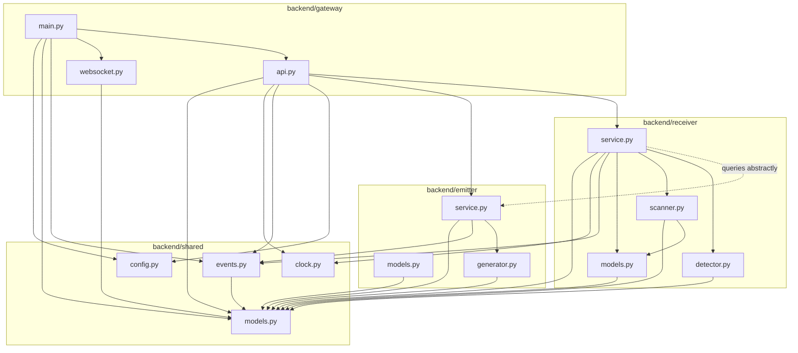

### Frontend Import Graph

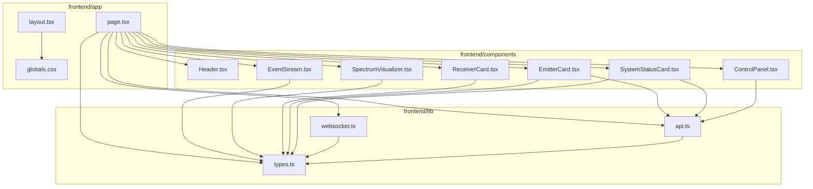

### Dependency & Coupling Analysis
- **Circular Dependencies**: **0 found**. The import flow is strictly acyclic (`shared` &rarr; `emitter`/`receiver` &rarr; `gateway`).
- **Suspicious Dependencies**: None. Receiver holds a reference to `EmitterService` passed via constructor injection exclusively to call `query_emissions_in_window`. Receiver does not mutate or import emitter internals.
- **Duplicated Models**: Zero duplication in Python backend. On frontend, TypeScript definitions in `frontend/lib/types.ts` mirror backend Pydantic models with identical property names and casing.
- **Unnecessary Coupling**: None. The WebSocket broadcaster (`ws_manager`) has no knowledge of specific event types—it listens to `*` on `EventBus` and forwards envelopes as JSON.

---

## 4. Runtime Architecture

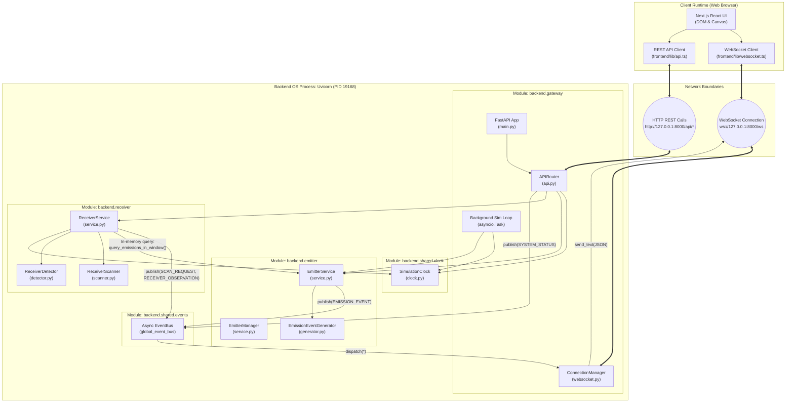

---

## 5. Frontend Architecture

### Component Hierarchy & Data Flow

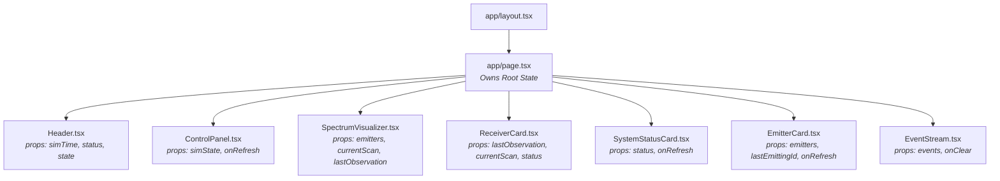

### Detailed Component Specifications

#### `app/page.tsx`
- **Role**: Top-level coordinator. Manages active WebSocket connection, subscribes to event types, maintains centralized state, and periodically polls REST API on connection status transitions.
- **State Variables**:
  - `connectionStatus`: `'CONNECTING' | 'CONNECTED' | 'DISCONNECTED'`
  - `systemStatus`: `SystemStatus | null`
  - `emitters`: `EmitterConfig[]`
  - `currentScan`: `ScanWindow | null`
  - `lastObservation`: `Observation | null`
  - `lastEmittingId`: `string | undefined` (triggers visual flash in emitter card)
  - `events`: `EventMessage[]` (capped at last 150 items)
- **Lifecycle**:
  - `useEffect`: Calls `wsClient.connect()`.
  - Subscribes to `SYSTEM_STATUS`, `EMITTER_LIST`, `EMISSION_EVENT`, `SCAN_REQUEST`, `RECEIVER_OBSERVATION`.
  - Cleans up subscriptions and calls `wsClient.disconnect()` on unmount.

#### `components/Header.tsx`
- **Props**: `connectionStatus`, `simulationTime`, `simulationState`, `speed`.
- **Display**: High-contrast tactical bar with pulsating LED status badge, numerical clock (`T+ 12.450s`), and status chip (`RUNNING` / `PAUSED`).

#### `components/ControlPanel.tsx`
- **Props**: `simulationState`, `onRefreshStatus`.
- **Interactive Triggers**:
  - `Run Sim` / `Pause Sim`: Calls `api.startSimulation()` / `api.pauseSimulation()`.
  - `Step +25ms`: Calls `api.stepSimulation(0.025)`.
  - `Reset`: Calls `api.resetSimulation()`.
  - `Quick Scan (700 -> 1200 MHz)`: Calls `api.executeScan({ action_id, frequency_start_hz: 700e6, bandwidth_hz: 500e6, dwell_time_ms: 25 })`.
  - `Custom Scan`: Takes arbitrary start frequency and dwell duration.

#### `components/SpectrumVisualizer.tsx`
- **Props**: `emitters`, `currentScan`, `lastObservation`.
- **Coordinate Conversion**:
  $$\text{percent} = \frac{f - 500\text{ MHz}}{2000\text{ MHz} - 500\text{ MHz}} \times 100$$
- **Visual Layers**:
  1. Frequency grid markings (500, 750, 1000, 1250, 1500, 1750, 2000 MHz).
  2. Ambient noise floor baseline.
  3. Dynamic 500 MHz instantaneous scan window bracket (`left: scanStartPct`, `width: scanWidthPct`).
  4. Emitter power spectral bars with color coding by behavior type.
  5. Glowing `HIT` badges when an emitter ID matches `lastObservation.detections`.

#### `components/EventStream.tsx`
- **Props**: `events`, `onClear`.
- **Features**: Monospaced terminal display, automated scroll-lock pinned to bottom, color-coded badges per event type (`EMISSION_EVENT` in cyan, `SCAN_REQUEST` in blue, `RECEIVER_OBSERVATION` in emerald).

---

## 6. Backend Service Architecture

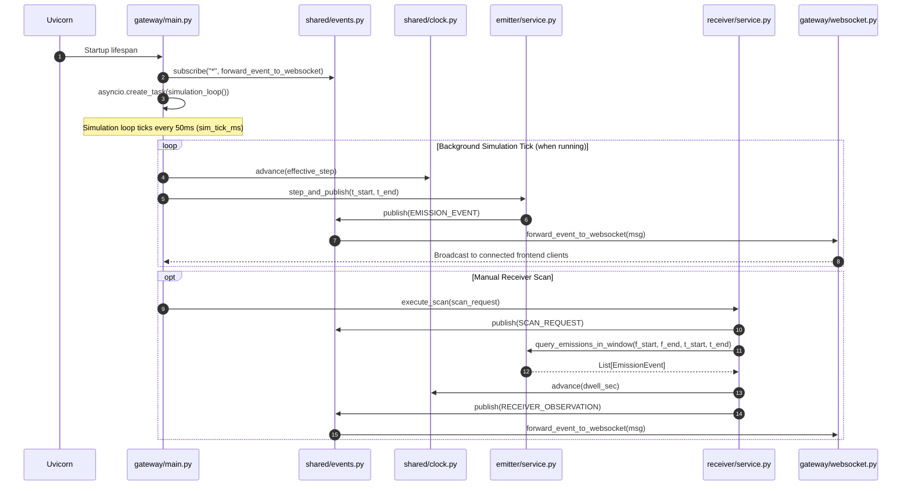

### Backend Lifespan & Thread Model
- **Process**: Single Python process executing on the asyncio event loop.
- **Thread Safety**: `SimulationClock` encapsulates internal synchronization via `threading.Lock` so that any future background workers can query or advance time safely.
- **Event Bus Routing**: Fully non-blocking. When `EventBus.publish()` is called, all matching async callbacks are executed within the current loop context without blocking socket IO.

---

## 7. Data Model Map

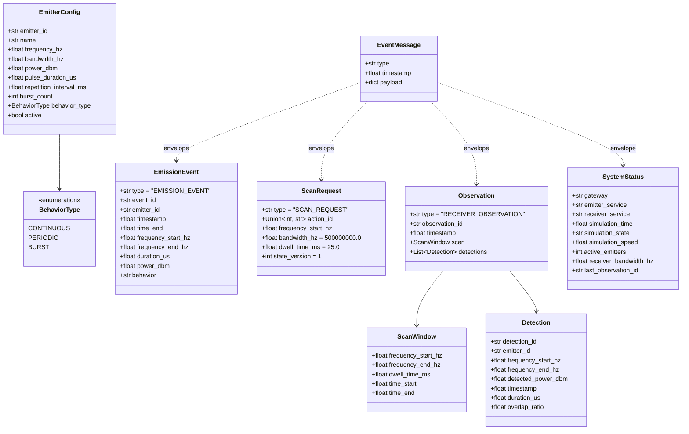

### Complete Model Schema Reference

| Model | Field | Type | Default | Required? | Created By | Modified By | Consumed By |
|-------|-------|------|---------|-----------|------------|-------------|-------------|
| `EmitterConfig` | `emitter_id` | `str` | N/A | **Yes** | `EmitterManager._load_default_emitters()` | REST `/api/emitters` | `EmissionEventGenerator`, `EmitterCard` |
| `EmitterConfig` | `frequency_hz` | `float` | N/A | **Yes** | Scenario / Manager | REST API | `EmitterService`, `SpectrumVisualizer` |
| `EmitterConfig` | `bandwidth_hz` | `float` | `10000000.0` | No | Scenario / Manager | REST API | `EmissionEventGenerator`, `SpectrumVisualizer` |
| `EmitterConfig` | `power_dbm` | `float` | `30.0` | No | Scenario / Manager | REST API | `EmissionEventGenerator`, `SpectrumVisualizer` |
| `EmitterConfig` | `pulse_duration_us`| `float` | `250.0` | No | Scenario / Manager | REST API | `EmissionEventGenerator` |
| `EmitterConfig` | `repetition_interval_ms`| `float` | `50.0` | No | Scenario / Manager | REST API | `EmissionEventGenerator` |
| `EmitterConfig` | `burst_count` | `int` | `3` | No | Scenario / Manager | REST API | `EmissionEventGenerator` |
| `EmitterConfig` | `behavior_type` | `BehaviorType`| `BURST` | No | Scenario / Manager | REST API | `EmissionEventGenerator`, `EmitterCard` |
| `EmitterConfig` | `active` | `bool` | `True` | No | Manager | REST `/toggle` | `EmitterService.query_emissions_in_window()` |
| `EmissionEvent` | `event_id` | `str` | N/A | **Yes** | `EmissionEventGenerator` | None (immutable) | `ReceiverDetector`, `EventStream` |
| `EmissionEvent` | `timestamp` | `float` | N/A | **Yes** | `EmissionEventGenerator` | None | `ReceiverDetector`, Event Stream |
| `EmissionEvent` | `time_end` | `float` | N/A | **Yes** | `EmissionEventGenerator` | None | `ReceiverDetector` |
| `EmissionEvent` | `frequency_start_hz`| `float` | N/A | **Yes** | `EmissionEventGenerator` | None | `ReceiverDetector` |
| `EmissionEvent` | `frequency_end_hz` | `float` | N/A | **Yes** | `EmissionEventGenerator` | None | `ReceiverDetector` |
| `ScanRequest` | `action_id` | `int \| str` | `1001` | No | Frontend ControlPanel | None | `ReceiverScanner`, `EventStream` |
| `ScanRequest` | `frequency_start_hz`| `float` | N/A | **Yes** | Frontend ControlPanel | None | `ReceiverScanner.build_scan_window()` |
| `ScanRequest` | `bandwidth_hz` | `float` | `500000000.0` | No | Frontend ControlPanel | Clamped to 500MHz | `ReceiverScanner` |
| `ScanRequest` | `dwell_time_ms`| `float` | `25.0` | No | Frontend ControlPanel | None | `ReceiverScanner` |
| `ScanWindow` | `frequency_start_hz`| `float` | N/A | **Yes** | `ReceiverScanner` | None | `SpectrumVisualizer`, `ReceiverCard` |
| `ScanWindow` | `frequency_end_hz` | `float` | N/A | **Yes** | `ReceiverScanner` | Computed ($f_{start} + BW$) | `SpectrumVisualizer`, `ReceiverCard` |
| `ScanWindow` | `dwell_time_ms` | `float` | N/A | **Yes** | `ReceiverScanner` | None | `ReceiverCard` |
| `ScanWindow` | `time_start` | `float` | N/A | **Yes** | `ReceiverScanner` | From `clock.now()` | `EventStream`, `ReceiverService` |
| `ScanWindow` | `time_end` | `float` | N/A | **Yes** | `ReceiverScanner` | Computed ($t_{start} + dwell$) | `ReceiverService` |
| `Detection` | `detection_id` | `str` | N/A | **Yes** | `ReceiverDetector` | None | `ReceiverCard`, `SpectrumVisualizer` |
| `Detection` | `emitter_id` | `str` | N/A | **Yes** | `ReceiverDetector` | None | `ReceiverCard`, `SpectrumVisualizer` |
| `Detection` | `detected_power_dbm`| `float` | N/A | **Yes** | `ReceiverDetector` | None | `ReceiverCard` |
| `Detection` | `overlap_ratio`| `float` | `1.0` | No | `ReceiverDetector` | Computed | `ReceiverCard` |
| `Observation` | `observation_id`| `str` | N/A | **Yes** | `ReceiverService` | None | `ReceiverCard`, `SystemStatus` |
| `Observation` | `timestamp` | `float` | N/A | **Yes** | `ReceiverService` | From `clock.now()` | `ReceiverCard`, `EventStream` |
| `Observation` | `scan` | `ScanWindow` | N/A | **Yes** | `ReceiverService` | Nested | `SpectrumVisualizer`, `ReceiverCard` |
| `Observation` | `detections` | `List[Detection]`| `[]` | No | `ReceiverDetector` | Populated | `SpectrumVisualizer` (HIT), `ReceiverCard` |
| `SystemStatus` | `simulation_time`| `float` | `0.0` | No | `api.py:get_system_status()`| Read from `clock.now()`| `Header` |

---

## 8. Variable Data-Lineage Analysis

### `simulation_time`

```text
SimulationClock._current_time (shared/clock.py)
      ↓
clock.advance(delta_seconds) (invoked by simulation_loop or receiver dwell)
      ↓
SystemStatus.simulation_time (backend/gateway/api.py)
      ↓
EventMessage(type="SYSTEM_STATUS", timestamp=simulation_time)
      ↓
WebSocket broadcast (/ws)
      ↓
frontend/lib/websocket.ts -> onmessage
      ↓
frontend/app/page.tsx: setSystemStatus
      ↓
frontend/components/Header.tsx: <span className="clock">{simulationTime.toFixed(3)}s</span>
```
- **Created in**: `backend/shared/clock.py` inside `SimulationClock.__init__()`.
- **Initial value**: `0.0` (seconds).
- **Modified by**:
  1. `SimulationClock.advance(delta_seconds)`: Increments discrete time on ticks or receiver dwells.
  2. `SimulationClock.reset(start_time)`: Sets clock back to `0.0`.
- **Used by**: `ReceiverScanner.build_scan_window()`, `EmissionEventGenerator`, `Observation.timestamp`, `Header.tsx`.
- **User-visible output**: Pinned clock readout in top-right navigation header.

---

### `frequency_start_hz`

```text
User clicks "700 -> 1200 MHz" in ControlPanel.tsx
      ↓
api.executeScan({ frequency_start_hz: 700000000, bandwidth_hz: 500000000 })
      ↓
HTTP POST /api/receiver/scan (ScanRequest.frequency_start_hz = 700000000.0)
      ↓
ReceiverScanner.build_scan_window() -> ScanWindow.frequency_start_hz = 700000000.0
      ↓
ReceiverService.execute_scan() -> EmitterService.query_emissions_in_window()
      ↓
ReceiverDetector.evaluate_emissions() -> Detection.frequency_start_hz
      ↓
Observation.scan.frequency_start_hz
      ↓
EventMessage(type="RECEIVER_OBSERVATION") broadcast over WebSocket
      ↓
SpectrumVisualizer.tsx: freqToPercent(activeScan.frequency_start_hz)
      ↓
CSS left bracket positioned precisely at 700 MHz on spectrum canvas
```
- **Created in**: `frontend/components/ControlPanel.tsx` or REST API caller payload.
- **Initial value**: `700_000_000.0` Hz (700 MHz).
- **Passed to**: `backend/receiver/service.py:execute_scan()` inside `ScanRequest`.
- **Modified by**: Clamped / validated against `ReceiverConfig.min_frequency_hz`.
- **Used by**: `ReceiverScanner` to calculate `frequency_end_hz`, and `ReceiverDetector` to calculate frequency intersection.
- **User-visible output**: Left boundary of cyan 500 MHz instantaneous scan window on the visualizer and text in `ReceiverCard`.

---

### `frequency_end_hz`

```text
ScanRequest(frequency_start_hz = 700000000, bandwidth_hz = 500000000)
      ↓
ReceiverScanner: freq_end = freq_start + min(request_bw, instantaneous_bw)
      ↓
ScanWindow.frequency_end_hz = 1200000000.0 (1.2 GHz)
      ↓
EmitterService.query_emissions_in_window(700e6, 1200e6, ...)
      ↓
ReceiverDetector checks: emission.freq_start <= 1200e6
      ↓
Observation.scan.frequency_end_hz
      ↓
SpectrumVisualizer: scanWidthPct = freqToPercent(1200e6) - freqToPercent(700e6)
```
- **Created in**: `backend/receiver/scanner.py` in `build_scan_window()`.
- **Computation**:
  $$\text{frequency\_end\_hz} = \text{frequency\_start\_hz} + \min(\text{request.bandwidth\_hz}, 500\text{ MHz})$$
- **Initial value**: Calculated on each scan (e.g., $700\text{ MHz} + 500\text{ MHz} = 1200\text{ MHz}$).
- **Used by**: Frequency overlap filters and graphical width sizing.
- **User-visible output**: Right boundary of the highlighted instantaneous scan bracket.

---

### `action_id`

```text
Math.floor(1000 + Math.random() * 9000) (frontend/components/ControlPanel.tsx)
      ↓
ScanRequest.action_id (e.g. 4821)
      ↓
ReceiverService: logged as [12.450] RECEIVER started scan
      ↓
EventMessage(type="SCAN_REQUEST", payload={ action_id: 4821 })
      ↓
WebSocket broadcast
      ↓
EventStream.tsx: logs "Tune window 700.0 -> 1200.0 MHz"
```
- **Created in**: `frontend/components/ControlPanel.tsx` (or an external scheduler service in future phases).
- **Initial value**: Integer or string identifier (e.g., `1001`, `4821`).
- **Used by**: Telemetry tracking to correlate command requests with downstream observations.

---

### `observation_id`

```text
ReceiverService.state.total_scans_completed (e.g. 0)
      ↓
obs_id = f"OBS-{total_scans_completed + 1:04d}" (e.g. "OBS-0001")
      ↓
Observation(observation_id="OBS-0001")
      ↓
ReceiverState.last_observation = observation
      ↓
EventMessage(type="RECEIVER_OBSERVATION", payload={ observation_id: "OBS-0001" })
      ↓
WebSocket /ws -> page.tsx: setLastObservation
      ↓
ReceiverCard.tsx: "Latest Observation: OBS-0001"
```
- **Created in**: `backend/receiver/service.py:execute_scan()`.
- **Format**: Zero-padded sequential string (`OBS-0001`, `OBS-0002`).
- **Used by**: Frontend to display latest observation identity and verify scan sequence completion.

---

### `emitter_id`

```text
EmitterManager._load_default_emitters() ("E001", "E002", "E003")
      ↓
EmissionEventGenerator -> EmissionEvent.emitter_id = "E001"
      ↓
ReceiverDetector matches overlap -> Detection.emitter_id = "E001"
      ↓
Observation.detections = [Detection(emitter_id="E001", ...)]
      ↓
WebSocket -> page.tsx -> SpectrumVisualizer.tsx
      ↓
detectedEmitterIds.has("E001") -> renders green [HIT] badge on E001 pillar
```
- **Created in**: `backend/emitter/service.py` via configuration or scenario files.
- **Initial values**: `"E001"`, `"E002"`, `"E003"`.
- **Passed through**: `EmissionEvent` &rarr; `Detection` &rarr; `Observation` &rarr; WebSocket &rarr; Frontend.
- **User-visible output**: Emitter cards, detection summary chips, and glowing `HIT` indicator over active radar bars.

---

### `overlap_ratio`

```text
em_bandwidth = emission.frequency_end_hz - emission.frequency_start_hz
overlap_bw = min(scan.freq_end, emission.freq_end) - max(scan.freq_start, emission.freq_start)
      ↓
overlap_ratio = min(1.0, max(0.0, overlap_bw / em_bandwidth))
      ↓
Detection(overlap_ratio = 1.0)
      ↓
ReceiverCard.tsx: used to verify spectral coverage of intercepted pulse
```
- **Created in**: `backend/receiver/detector.py:evaluate_emissions()`.
- **Range**: `0.0` to `1.0` (indicates what fraction of emitter signal was captured within the 500 MHz instantaneous window).

---

## 9. API Flow & Endpoints

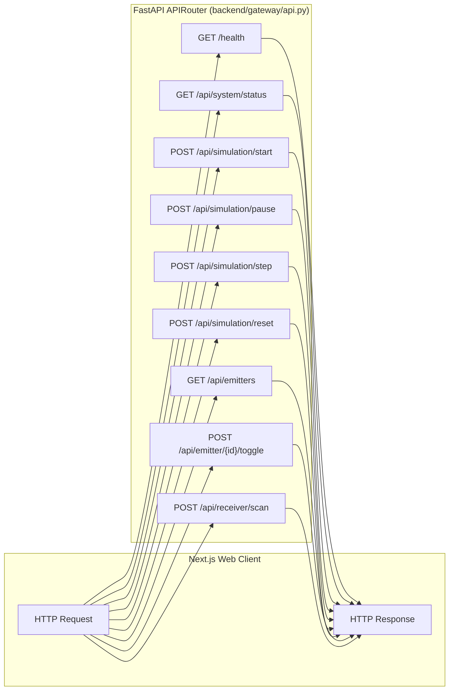

### Complete REST Route Table

| Method | Path | Request Body | Response Body | HTTP Status | Description |
|--------|------|--------------|---------------|-------------|-------------|
| `GET` | `/health` | None | `{"status": "ok", "service": "gateway"}` | `200` | Liveness and health check |
| `GET` | `/api/system/status` | None | `SystemStatus` schema | `200` | Full component state (gateway, emitter, receiver, sim time) |
| `POST` | `/api/simulation/start` | `{"speed": 1.0}` (opt) | `{"status": "ok", "simulation_state": "RUNNING"}` | `200` | Unpauses background tick loop |
| `POST` | `/api/simulation/pause` | None | `{"status": "ok", "simulation_state": "PAUSED"}` | `200` | Pauses background tick loop |
| `POST` | `/api/simulation/reset` | None | `{"status": "ok", "simulation_time": 0.0}` | `200` | Resets clock to 0.000s |
| `POST` | `/api/simulation/step` | `{"delta_seconds": 0.025}` | `{"time_start": float, "time_end": float, "emissions_generated": int}` | `200` | Advances clock by discrete delta and publishes emissions |
| `GET` | `/api/emitters` | None | `List[EmitterConfig]` | `200` | Returns all registered emitters |
| `POST` | `/api/emitters` | `EmitterConfig` | `EmitterConfig` | `200` | Registers or updates an emitter |
| `POST` | `/api/emitter/{emitter_id}/toggle` | None | `{"emitter_id": str, "active": bool}` | `200` / `404` | Toggles active state of specified emitter |
| `POST` | `/api/emitter/start` | None | `{"status": "ok", "emitter_service": "RUNNING"}` | `200` | Resumes emitter emission generation |
| `POST` | `/api/emitter/stop` | None | `{"status": "ok", "emitter_service": "STOPPED"}` | `200` | Halts emitter emission generation |
| `GET` | `/api/receiver/state` | None | `{"config": dict, "state": dict}` | `200` | Returns hardware parameters & scan counters |
| `POST` | `/api/receiver/start` | None | `{"status": "ok", "receiver_service": "RUNNING"}` | `200` | Enables receiver scanning |
| `POST` | `/api/receiver/stop` | None | `{"status": "ok", "receiver_service": "STOPPED"}` | `200` | Disables receiver scanning |
| `POST` | `/api/receiver/scan` | `ScanRequest` | `Observation` | `200` / `500` | Executes 500 MHz instantaneous scan dwell & returns detections |

---

## 10. WebSocket Flow & Streaming Protocol

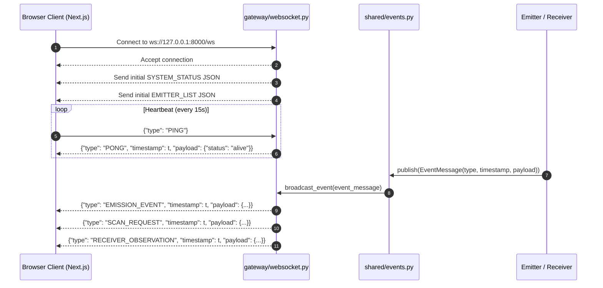

### JSON Message Envelopes

Every message dispatched across the WebSocket conforms to the `EventMessage` schema:

```json
{
  "type": "RECEIVER_OBSERVATION",
  "timestamp": 12.475,
  "payload": {
    "observation_id": "OBS-0001",
    "timestamp": 12.475,
    "scan": {
      "frequency_start_hz": 700000000.0,
      "frequency_end_hz": 1200000000.0,
      "dwell_time_ms": 25.0,
      "time_start": 12.450,
      "time_end": 12.475
    },
    "detections": [
      {
        "detection_id": "DET-A3C910B2",
        "emitter_id": "E001",
        "frequency_start_hz": 925000000.0,
        "frequency_end_hz": 935000000.0,
        "detected_power_dbm": 30.0,
        "timestamp": 12.450,
        "duration_us": 250.0,
        "overlap_ratio": 1.0
      }
    ]
  }
}
```

---

## 11. Simulation-Time Flow & Clock Engine

```mermaid
graph TD
    A["SimulationClock (backend/shared/clock.py)"] -->|Initializes| B["_current_time = 0.000000"]
    
    subgraph AdvancingTime["Two Drivers of Simulation Time"]
        DRV1["Background Simulation Loop<br/>(ticks every 50ms: advances by 0.050s * speed)"]
        DRV2["Receiver Scan Dwell<br/>(advances clock by dwell_time_sec, e.g. +0.025s)"]
    end

    DRV1 -->|advance(dt)| A
    DRV2 -->|advance(dt)| A

    A -->|now()| C["Evaluation Windows [t_start, t_end]"]
    C -->|Queried by| D["EmissionEventGenerator (pulse timing)"]
    C -->|Recorded in| E["ScanWindow (dwell interval)"]
    C -->|Timestamped on| F["Observation & Events"]
```

### Mathematical Formulation
Let $t_{\text{sim}}$ denote simulation time. Time advances deterministically:
$$t_{\text{next}} = \text{round}(t_{\text{current}} + \Delta t, 6)$$
- For the background ticker: $\Delta t = \frac{\text{SIMULATION\_TICK\_MS}}{1000.0} \times \text{speed}$.
- For receiver scanning: $\Delta t = \frac{\text{dwell\_time\_ms}}{1000.0}$.
- Wall-clock time is **never** used to evaluate whether an RF pulse occurred.

---

## 12. Emitter ↔ Receiver Decoupled Flow

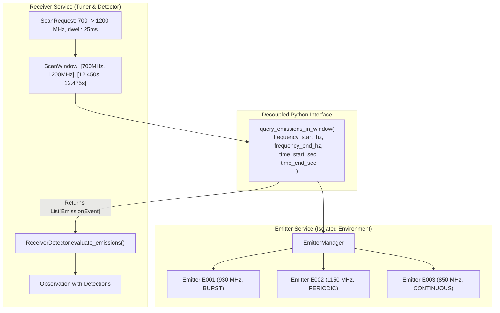

### Decoupling Invariants
1. The receiver does **not** simulate waveform synthesis.
2. The emitter does **not** know what frequency the receiver is tuned to.
3. The interface is purely functional and query-based: passing bounded intervals $[f_{\min}, f_{\max}]$ and $[t_{\text{start}}, t_{\text{end}}]$.
4. In future distributed phases, this in-memory call can be swapped for gRPC or ZeroMQ with zero architectural change to the receiver.

---

## 13. Receiver Scan Lifecycle

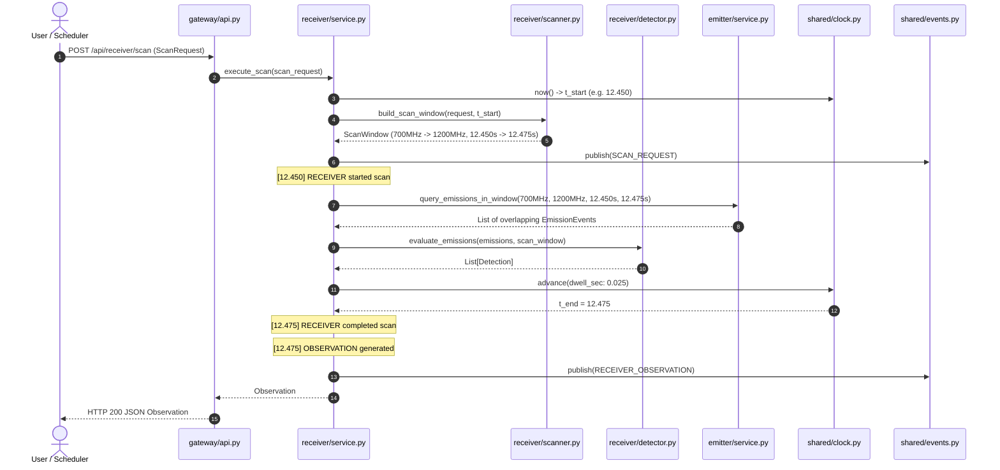

---

## 14. Observation Lifecycle

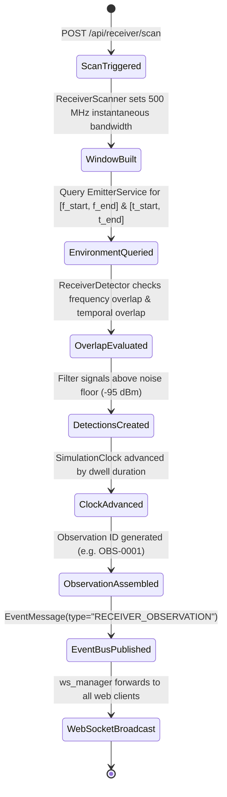

---

## 15. Frontend Update & Rendering Lifecycle

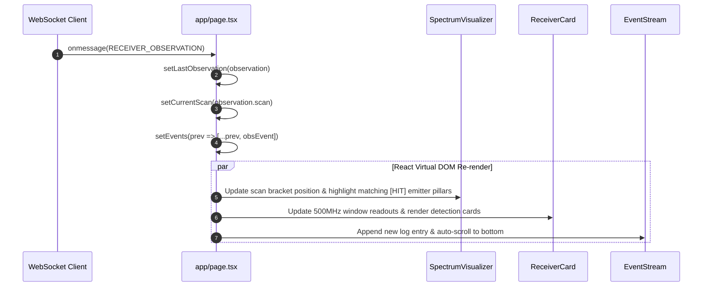

---

## 16. Complete End-to-End Execution Trace

### Scenario: User clicks "700 &rarr; 1200 MHz (S-Band)" quick scan in browser

| Step | Component | Action / Execution Path | Data Payload |
|------|-----------|-------------------------|--------------|
| **1** | `frontend/components/ControlPanel.tsx` | User clicks button. Triggers `handleExecuteScan(700, 25)`. | `startFreqMhz = 700`, `dwellTimeMs = 25` |
| **2** | `frontend/lib/api.ts` | Dispatches HTTP POST request. | `ScanRequest{ action_id: 8412, frequency_start_hz: 700000000.0, bandwidth_hz: 500000000.0, dwell_time_ms: 25.0 }` |
| **3** | `backend/gateway/api.py` | Route handler `@router.post("/api/receiver/scan")` receives payload and forwards to `receiver_service`. | Validated `ScanRequest` Pydantic model |
| **4** | `backend/receiver/service.py` | Reads current clock time: `clock.now()` &rarr; `12.450s`. Calls `scanner.build_scan_window()`. | `time_start = 12.450`, `time_end = 12.475` |
| **5** | `backend/receiver/scanner.py` | Computes: `freq_start = 700 MHz`, `freq_end = 700 MHz + 500 MHz = 1200 MHz`. | `ScanWindow(frequency_start_hz=7e8, frequency_end_hz=1.2e9, dwell_time_ms=25.0, time_start=12.45, time_end=12.475)` |
| **6** | `backend/shared/events.py` | Publishes `SCAN_REQUEST` event to `global_event_bus`. | `EventMessage(type="SCAN_REQUEST", timestamp=12.450, payload={...})` |
| **7** | `backend/gateway/websocket.py` | Lifespan subscriber picks up event and sends JSON to WebSocket. | WebSocket frame dispatched to browser client |
| **8** | `backend/emitter/service.py` | Receiver calls `query_emissions_in_window(7e8, 1.2e9, 12.45, 12.475)`. Emitter checks active sources: E001 (930MHz) is inside [700, 1200MHz], E003 (850MHz) is inside [700, 1200MHz], E002 (1150MHz) is inside [700, 1200MHz]. | Emitter generates pulse slices falling in $[12.450, 12.475]$ |
| **9** | `backend/receiver/detector.py` | Receives emissions. Evaluates frequency overlap and temporal overlap. Intercepts E001 (930MHz acquisition radar pulse) and E003 (850MHz continuous wave). | Creates `Detection(emitter_id="E001", ...)` and `Detection(emitter_id="E003", ...)` |
| **10** | `backend/shared/clock.py` | Receiver advances clock: `clock.advance(0.025)`. New time = `12.475s`. | Clock advances to `12.475` |
| **11** | `backend/receiver/service.py` | Assembles `Observation(observation_id="OBS-0001", timestamp=12.475, scan=..., detections=[...])`. Logs structured completion. | `Observation` model |
| **12** | `backend/shared/events.py` | Publishes `RECEIVER_OBSERVATION` to `global_event_bus`. | `EventMessage(type="RECEIVER_OBSERVATION", timestamp=12.475)` |
| **13** | `backend/gateway/websocket.py` | Broadcasts `RECEIVER_OBSERVATION` payload to connected browser WebSocket clients. | Transmitted via TCP socket |
| **14** | `frontend/lib/websocket.ts` | Receives socket frame, parses JSON, dispatches to `RECEIVER_OBSERVATION` handler. | Invokes callback registered in `app/page.tsx` |
| **15** | `frontend/app/page.tsx` | Updates React state: `setLastObservation(payload)` and appends to `events`. | React triggers component tree re-render |
| **16** | `frontend/components/SpectrumVisualizer.tsx` | Identifies intercepted IDs `{"E001", "E003"}`. Renders glowing green `HIT` badge above E001 and E003. Draws cyan 500 MHz bracket spanning 700 to 1200 MHz. | Canvas/SVG UI visual update |
| **17** | `frontend/components/ReceiverCard.tsx` | Shows `OBS-0001` with intercepted signals details (power, duration). | Detection list rendered |
| **18** | `frontend/components/EventStream.tsx` | Displays green `[12.475] RECEIVER_OBSERVATION: Observation OBS-0001: Signals: E001, E003`. | Terminal entry appended |

---

## 17. Deployment & Runtime Topology

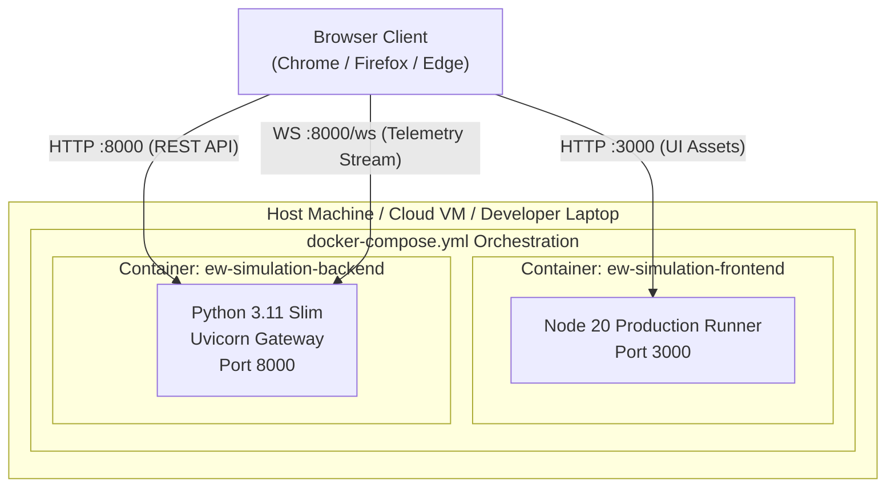

### Environment Configuration Strategy
Configuration is completely externalized via `.env`:
- `BACKEND_HOST`: `0.0.0.0`
- `BACKEND_PORT`: `8000`
- `FRONTEND_URL`: `http://localhost:3000`
- `RECEIVER_BANDWIDTH_HZ`: `500000000` (500 MHz)
- `DEFAULT_DWELL_TIME_MS`: `25.0`
- `SIMULATION_TICK_MS`: `50.0`
- `NEXT_PUBLIC_API_URL`: `http://localhost:8000`
- `NEXT_PUBLIC_WS_URL`: `ws://localhost:8000`

---

## 18. Future Extension Points & Boundaries

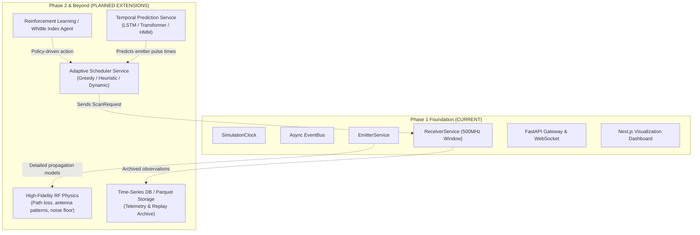

### Explicit Architectural Guardrails for Future Work
1. **Scheduler Integration**: The future Scheduler service will issue `ScanRequest` objects to `POST /api/receiver/scan`. It will **never** directly inspect the Emitter environment.
2. **Machine Learning / Prediction**: Prediction models consume past `Observation` objects from the receiver and estimate future emitter transition probabilities. They interact with the system strictly as external decision-makers.
3. **RF Physics Engine**: When complex propagation physics (free-space path loss, atmospheric attenuation, radar cross-section) are added, they will be encapsulated inside the `Emitter ↔ Receiver` query boundary without altering the `ScanRequest` or `Observation` schemas.
4. **No Database in Core Loop**: In-memory event dispatching ensures high simulation throughput without database locking bottlenecks.
